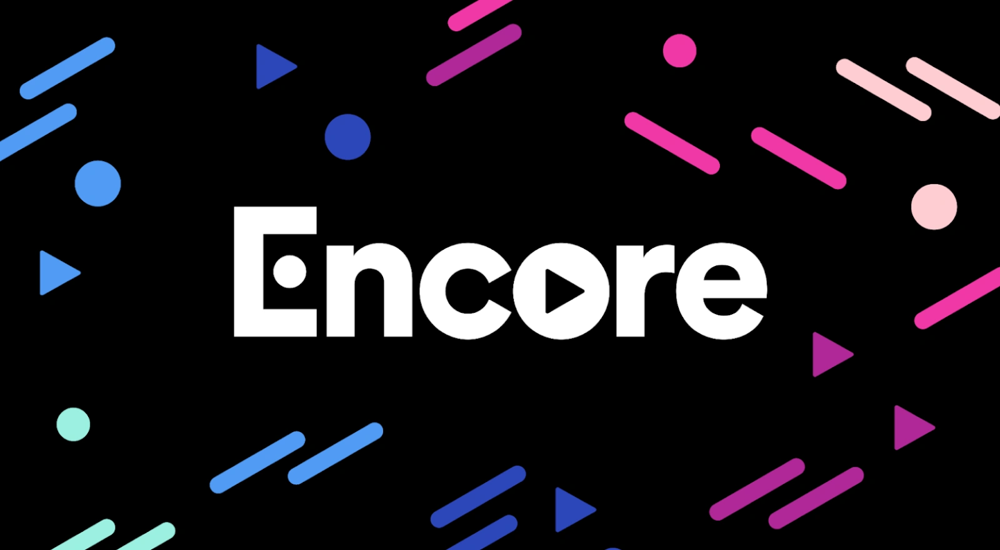
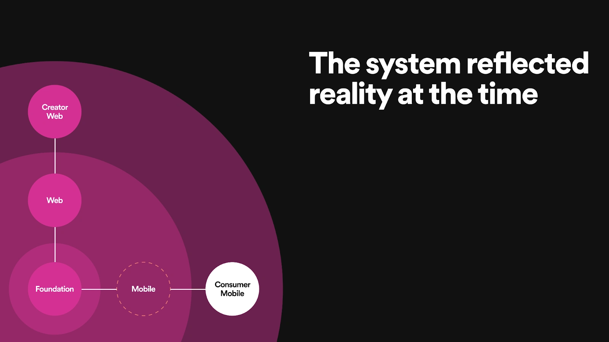
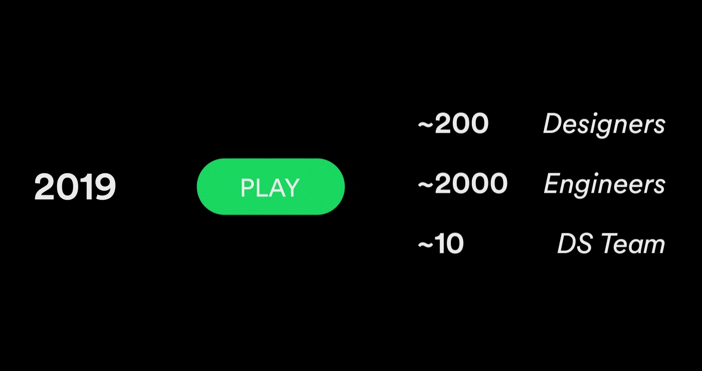
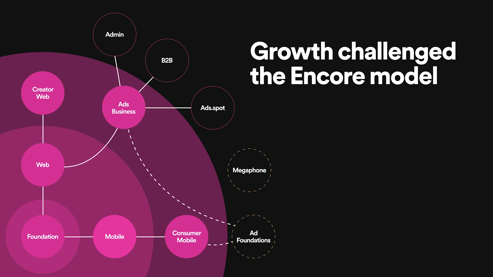
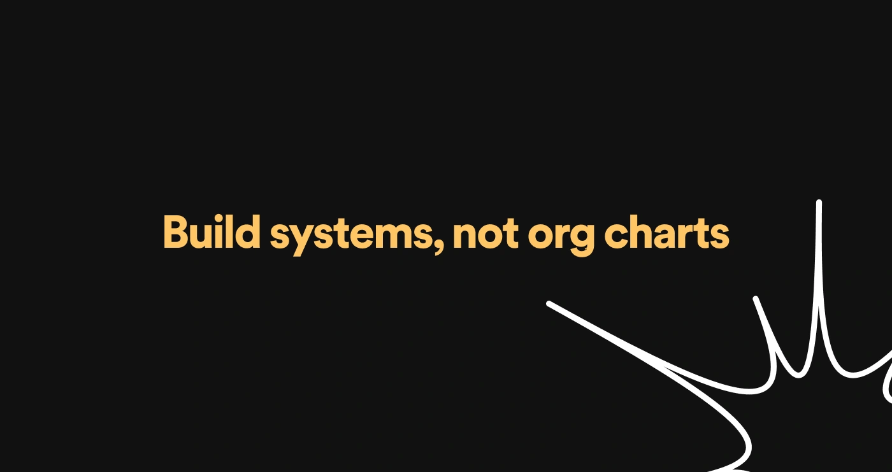
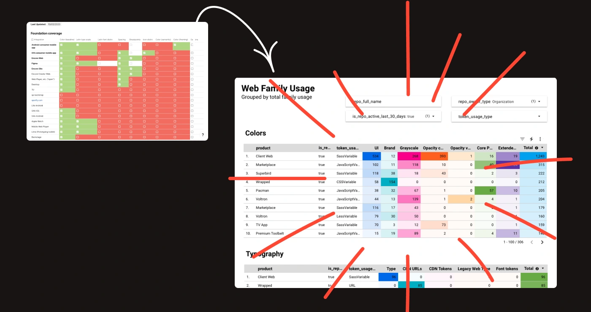
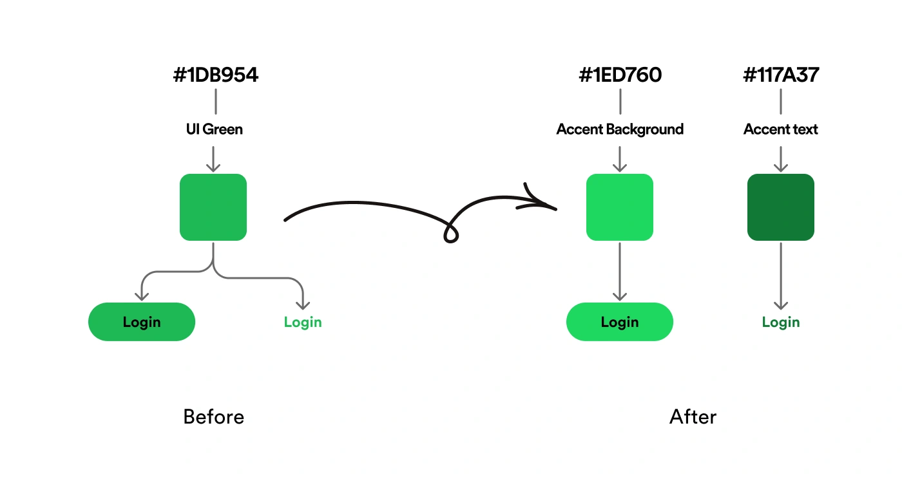
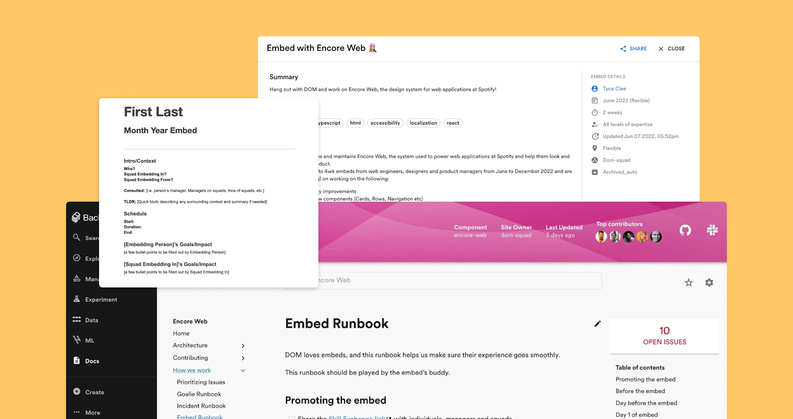

_This article was originally co-written with Tyce Clee, Engineering Manager and published on the [Spotify Design blog](https://spotify.design/article/can-i-get-an-encore-spotifys-design-system-three-years-on) in December 2022. It has been republished here for preservation._

We last spoke publicly about what Spotify is doing in the design system space in 2019 when we introduced a new system called Encore. Since then it's been radio silence. We haven't really said much or talked publicly despite being asked about it. We've had our heads down learning, thinking, and shipping. So, maybe you're curious. What have we been up to? How has Encore grown and evolved in the last few years? And what have we learned?

## A quick recap

The decisions we made about the design and structure of the system in 2019 were a reflection of the landscape we needed to build for.

We had to serve more than 45 different platforms that were being created by over 2,000 engineers and 200 designers.

When we disbanded GLUE, our old design system team, many grassroots systems spun up in its place. We managed to find an impressive 22 distinct design systems.

And finally, we put a lot of thought into how we'd go about creating a system made up of rules, patterns, and standards that would fit within our culture of autonomy.

## (re)Introducing Encore

Encore was our answer to this complex landscape of products, teams, and ways of working at Spotify.

It represented the consolidation of existing initiatives — some official and many grassroots. It provided a single, unified framework that would replace the 22 distinct design systems that existed previously. Encore was designed for Spotify's diverse set of use cases, across many platforms and experiences.

So we introduced what we called "a family of systems" or what's known in the design systems space as a "system of systems", rather than one single monolithic design system.

Each part of the Encore family is managed by a distributed team and typically inherits from another Encore system, starting from Foundation and working its way out.

This made everything more flexible — and fit better with Spotify's autonomous culture.

## Spotify has grown since then…

But that was three years ago and a lot has changed.

As our R&D organization has grown, our design system has needed to support more use cases, more platforms, and most importantly — more people.

We know that the built-in flexibility has enabled autonomy to some degree, but as Encore has gained adoption and popularity, we found that we needed to encourage standardization in order to achieve better consistency.

All of this growth, plus an increase in both local systems and frameworks for various products, has challenged the Encore organizational model and its ability to scale.

We combined our knowledge of Spotify's design and engineering strategies, and our strong relationships to get a clear signal on how we could improve our model moving forward.

## Key lessons learned

Now that you see where we've been, let's break it down into some lessons we've learned along the way.

### Lesson #1 – Reinforce our design goals, rather than our organizational model

Since launching Encore, it has rapidly become a great example of [Conway's law](https://www.atlassian.com/blog/teamwork/what-is-conways-law-acmi) or, in other words designing systems that reflect the org model. In our case, the idea of "local systems", a key principle for Encore's layered model, encouraged the system to reflect our org structure.

In a bid to create autonomy and drive usage, we created a system which conforms to our hierarchy rather than embracing a more cross-platform, experience-driven way of thinking.

We won't achieve our current business and design goals by working like this, but thanks to collaborating with our local system partners, we're now actively working on evolving this model and hope to share more with you early next year.

### Lesson #2 – Define and track success

Back in 2019, our way of tracking design system adoption was largely a box-ticking exercise. We were quite literally ticking boxes in a table.

Fast forward to 2022 and we now have data pipelines with dashboards for our key systems. We query repositories across the company each day to unearth exactly where and how many times tokens and components are used, how often customers are upgrading, and to identify trends and patterns that help us plan future roadmaps.

Our next step is to evolve our analytics system so that we can identify opportunities in codebases where tokens and components could be used, but aren't yet.

We are also establishing key metrics alongside adoption which tell a more complete picture of Encore's Usage, Contribution, Coverage, and Satisfaction.

### Lesson #3 – Balance the scales of reusability by investing in native components

When designing our system for mobile, we put the focus on flexibility. Our native experiences are where the majority of new features and experimentations take place, teams here need to move quickly, so we wanted to give them maximum flexibility.

On web, we took a more traditional approach, creating a library of reusable components. We've seen huge adoption and usage; teams are able to build and ship using our components.

As the mobile system has evolved, we've seen a growing sentiment amongst the designers and engineers working on our native platforms that they want, need, and expect more pre-built components that can be simply configured, composed, and consumed in a similar fashion to what we've seen be successful for our web system.

It's clear that we swung a little too far in the direction of flexibility and we're now balancing the scales by enabling more reusability on our native platforms. At the beginning of the year, we created a dedicated team to build a reusable set of components for mobile, with the goal of achieving a level of parity with what we currently offer on web.

### Lesson #4 – Non-semantic design tokens offer limited value

Our initial token system focused on being non-semantic, containing things like our color palette, spacers, and typography scales.

However, we quickly realized the limited value that these highly generic tokens offer as we found ourselves unable to safely change them without causing some alarming downstream regressions.

For example, as part of a large accessibility drive in late 2020, [we wanted to adjust the value of our most important color, Spotify Green, to improve contrast](https://spotify.design/article/better-in-black-rethinking-our-most-important-buttons). We knew the Spotify Green token was being used thousands of times across iOS, Android, and web, but we didn’t know where or how.

With this in mind, we've been investing heavily in introducing semantic layers into our token system so that we can better understand the context in which our tokens are being used, giving us the confidence to safely change values knowing the impact.

### Lesson #5 – Power our system with robots, algorithms, and automation

Even with the incredibly smart team of folks working on Encore, it was going to be very challenging for us to manually implement and maintain everything we wanted at the scale we needed.

This gave us an opportunity to work smarter, not harder.

So, we built an advanced design token integration with Figma. We created a bot that we call Figgy, to automatically synchronize changes made in our code source of truth across thousands of Figma files in minutes. This means design and code are always kept in sync.

To build the semantic token layers we mentioned in the previous lesson, we developed a color-theming algorithm that, given a few input values, can generate an entire color theme with guaranteed accessible color contrast.

We're continuing to invest in this approach and are now in the process of developing a new algorithm to generate layout and spacing themes, which will enable our components to scale and adapt to different devices and user modes.

### Lesson #6 – Strengthen our numbers and create advocates

In the early days of Encore, the web-based team recognized an increased level of interest and enthusiasm from the broader web community in key decisions we were making.

So we leaned heavily into the Spotify embed program where an individual contributor can join another team for two weeks, and up to multiple months, to help them ship projects or just learn and contribute.

The Encore embed program has now become a famous addition to our overall evangelization strategy. In 2022, we've had someone embedded on an Encore team every single day of the year.

The primary reason for hosting embeds is to build a stronger community of ownership around the system. As an added benefit, we get to improve our onboarding processes, strengthen our documentation, and help our teammates meet new colleagues in a remote climate.

We've had people join our teams from all over the world, not only bringing their diverse experiences and backgrounds but also helping us learn about what they do in their corner of Spotify.

## What's next for Encore?

Going into 2023, we will evolve our layered system model to address the constraints and opportunities we have identified.

Encore has grown organically into a bit of a spider's web and we need to simplify and refine in order to ensure we continue to support our internal communities and deliver on our design aspirations. We'll focus less on platforms and more on the experiences we're trying to create.

_Credit: header illustration by Jael Umerah-Makelemi_