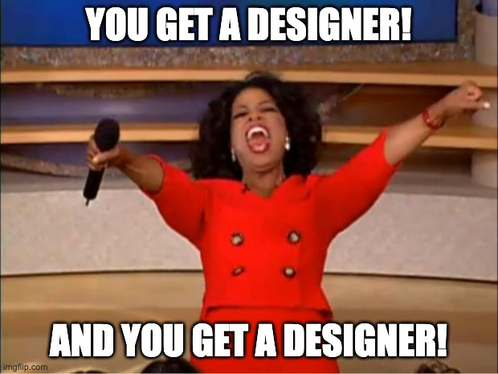

For a while now, I've been noticing a pattern in design system job postings. Designers everywhere. Engineers, not so much.

I needed to see if I was just imagining this, so I analysed 256 design system roles from two sources: the [Into Design Systems Jobs Directory](https://jobs.intodesignsystems.com/) and a year's worth of postings in the [Design Systems Slack](https://www.design.systems/) community, which has over 28,000 members. The split was consistent across both: 70% design-focused, 26% engineering-focused. **A 3:1 ratio.**

Breaking that down: of the 228 individual contributor roles, design outnumbered engineering 170 to 58. Again, nearly 3:1. The 26 management and leadership positions were also design-focused (15 to 11), though with a sample that small, it's hard to draw firm conclusions. What's clearer is the IC picture, and I’d guess that's where most of the hiring happens anyway.

In the week since I ran this analysis, another 10 roles were added to the Into Design Systems jobs board. 7 designers, 2 engineers, 1 product. The pattern continues.

{.c-article__image--sm}

Which raises an uncomfortable question: if the industry is hiring three designers for every engineer, who's actually implementing all this design work?

## Where the value comes from
Design systems need great designers. A well-crafted Figma library creates shared language, speeds up design iterations, and aligns teams around common patterns. That's real value.

But that value has a ceiling.

A Figma library, no matter how comprehensive, primarily helps designers. The moment a project moves to implementation, engineers are translating those designs into code. Every time. For every feature. Across every team.

The real value comes when patterns exist in production code. When a component lives in your codebase, every engineer building your product can use it. When you update it, that change ripples across every screen where it's deployed. When you need to make a sweeping visual change or make an accessibility improvement, you do it once, centrally, rather than hoping dozens of teams all update their local implementations correctly.

This is the promise of design systems: efficiency and consistency at scale. That promise is ultimately delivered through code.

Users don't interact with your Figma library. They interact with what is shipped in code.

## What I saw work
At Spotify, our design system team ran with a deliberately high ratio of engineers to designers. Originally around 6:1 and then reduced to 4:1 after a few rounds of layoffs.

Both our design and engineering outputs created value, but not in equal proportion. We understood that a significant portion of our value came from code implementation, and we staffed accordingly. Our system was heavily automated, with algorithmic token generation, sophisticated tooling, and infrastructure that required significant engineering investment to build and maintain.

Our system wouldn’t have functioned without designers, but it needed a significant team of engineers to build and operate it.

If that ratio had been inverted, with four designers for every engineer, we'd have generated plenty of design value. But the larger value, the part that actually reaches users, would have been permanently bottlenecked.

## So what's actually happening?

When I look at that 3:1 figure, I keep wondering what's going on behind the scenes. A few possibilities (read educated guesses):

**These are all new design systems, early in their maturity.** If you're just starting out, establishing design foundations before bringing in engineering capacity might make sense. Design first, implement later. But from reading a lot of these job descriptions, most are for roles working on existing design systems. And how many organisations have been in that "early maturity" phase for a year or more?

**Feature teams are doing the implementation.** Design system designers create the specs, and engineers on product teams build the components. This can work, but it means platform work is landing on people whose primary job is shipping features. That's a recipe for [inconsistent quality and competing priorities](https://www.shaunbent.co.uk/blog/why-federated-design-systems-keep-failing/#:~:text=The%20promise%3A%20contributions%20from%20multiple%20teams).

**The systems are staying in Figma.** Some organisations might be comfortable with design-only systems, and that's a valid choice. There's real value there. But it's worth being honest about the trade-off: without code implementation, you're leaving significant potential value on the table. Your organisation could be getting so much more value from your system.

**Engineers exist but aren't being hired as "design system engineers."** Look at the design roles, and you'll see specialisation: "Design System Designer," "Product Designer - Design Systems," titles that acknowledge this as a distinct discipline. The engineering equivalents are rarer. Are organisations hiring engineers to work on design systems, but they're advertising them as general frontend or platform roles? If so, what does that say about how the engineering side of this work is valued? Is Design system engineering is treated as something any engineer can pick up, while design system design is treated as a specialism?

**Teams are just badly understaffed on the engineering side.** Organisations see "design system" and think "design problem." They hire designers. The implementation backlog grows. The system never delivers on its promise. I really hope this is not the case.

## A few bright spots
It's worth noting an interesting trend I observed among the leadership roles advertised. Reviewing the job descriptions, I found several leadership roles that explicitly welcomed either design or engineering backgrounds. They're hiring for design systems leadership, not design leadership. 😍

This was encouraging to see. It suggests that at least some companies understand that this discipline spans both worlds and are hiring leadership accordingly.

But honestly, these felt like outliers.

## The uncomfortable question
Design work is undoubtedly valuable. But code is where you unlock the most value from your design system. So why are 70% of roles design-focused?

Either most organisations are getting far less value from their design systems than they could be. Or there's a massive amount of invisible engineering work happening somewhere that isn't showing up in job titles. Or the industry has collectively decided that design systems are a design discipline, and we're all just going along with it.

I don't have a tidy answer. But I do know what worked at scale: investing heavily in engineering capacity, treating implementation as the core work rather than a downstream task, and recognising that the source of truth is what ships to users.

The next time you're planning headcount for a design system team, it might be worth asking: are we building a design system, or are we just designing one?