_This article was originally co-written with Marina Posniak and Gerrit Kaiser and published on the [Spotify Design blog](https://spotify.design/article/reimagining-design-systems-at-spotify) in September 2020. It has been republished here for preservation._

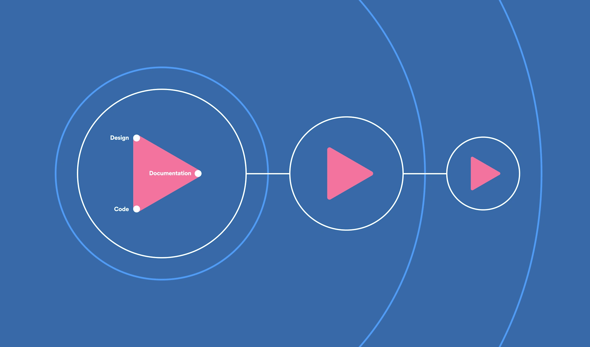

In November we introduced Encore, Spotify's new approach to design systems. What's cool about Encore is that it's not just one thing: it's actually a family of design systems, managed by distributed teams. In this post, we'll share what motivated us to create Encore, how it's structured, and how it's different from what we've tried before.

## How we got here

How should we do design systems at Spotify? That's a question we've tried to answer several times, through different approaches: from treating it as a one-off project to having a fully-staffed design team and lots of things in between.

In the early days of Spotify, there was no design system—we were building everything for the first time. When we launched the mobile app in 2009, there were few standards or shared patterns in place, and the Spotify experience started to get increasingly…inconsistent.

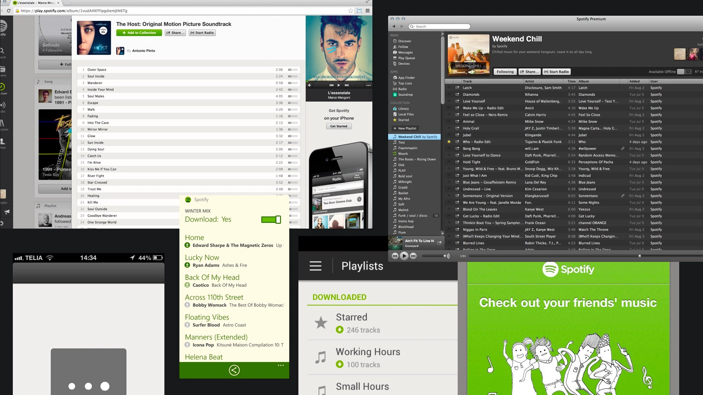

This drift continued until 2013, when we kicked off our first real attempt to align the visual design across platforms. This was a huge effort, and it had a big impact: [we introduced the signature dark experience](https://www.fastcompany.com/3028603/inside-the-redesign-why-spotify-went-black), and Spotify started to look something like what we're familiar with today.

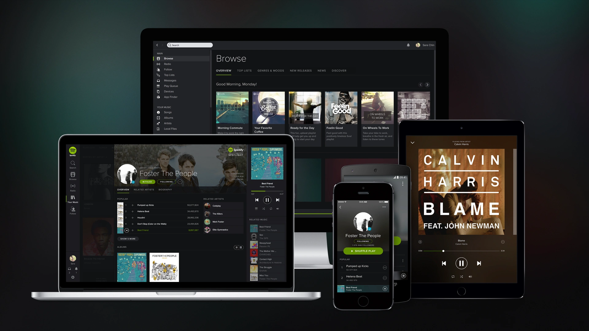

Then in 2014-2015, the Brand and Creative team [refreshed Spotify's brand identity](https://www.fastcompany.com/3043547/spotifys-new-look-signals-its-identity-shift) in a major way. We had a new color palette, a new typeface (Circular), and lots of visual updates that needed to be integrated into our apps. To do this, we set up a fully-staffed team to create a design system for Spotify, rather than treating it like a one-off project. We called this design system GLUE, aka Global Language Unified Experience ([you may have heard of this one](https://medium.com/@hellostanley/design-doesnt-scale-4d81e12cbc3e)).

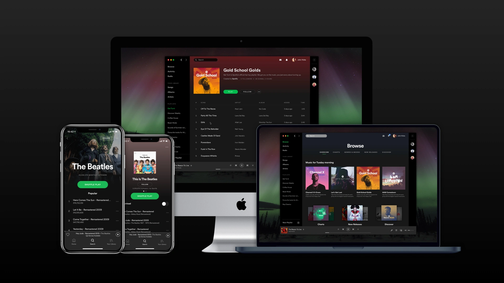

The GLUE design system was a success in lots of ways. The team refreshed Spotify's look and feel, standardized many of our components across mobile and desktop, and grew from a handful of people to 30+ full-time engineers and designers.

But there was a catch: GLUE was a single, centralized team. This was great for consistency, and many companies find that a centralized team works for them. For us, though, it became a bottleneck. Why? It comes down to how the organization is set up. Spotify values "aligned autonomy" and empowers teams (squads) to make their own decisions. After a while, we saw that having a centralized design systems team didn't fit with this way of working.

In 2018, Spotify continued to grow, and fast.

We had 200 designers.

2000 engineers.

45 different platforms.

The days of designing for mobile and desktop were long gone. Now we were also designing for cars, smartwatches, speakers, and even smart fridges. This was in part due to a new company strategy: ubiquity. We wanted to make it possible for listeners to access Spotify anywhere.

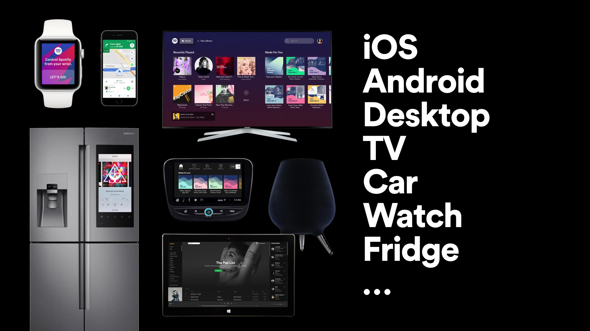

With Spotify moving in all these exciting new directions, we saw a pressing need for new components, patterns, toolkits, and all the other time-saving, efficiency-boosting resources a design system provides. The issue was the GLUE team had been disbanded by this point, and no one was actively pushing the GLUE design system forward.

That's when we entered the "grassroots" phase of Spotify design systems. Designers and engineers around the company took it upon themselves to make their own design systems. For example, a team in New York started working on Tape, a design system for web. (Get it? Tape? And Glue? Yes, we love a pun.) A team in Stockholm started a different system for design tokens; and so on.

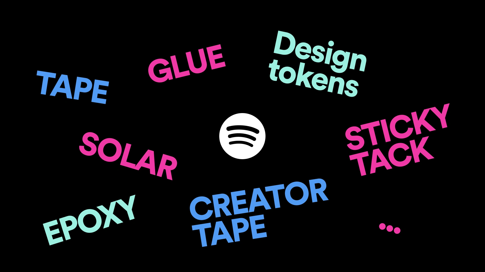

A lot of great work went into these ground-up efforts, and we're still using parts of these systems today. But this extremely decentralized, "everyone make your own" approach wasn't sustainable. At one point, we counted _22 different design systems_ floating around. Can you imagine being a new designer or engineer and asking, "Hey, do we have a design system?" and the answer is, "Yeah, we actually have 22"? Pretty confusing.

## Let's give it another go

Spotify really needed a _useful, unified_ design system—but we knew that a centralized team like GLUE probably wouldn't work. So, in 2018, we kicked off a new effort to create a design system for the company.

This time, we wanted to _design_ our design system, just like we'd design one of our product experiences. We weren't starting with a completely blank slate, though. We wanted to consolidate the resources we had, and create a system that felt unified, accessible, collaborative, and based on a coherent vision.

Most importantly, we wanted a system that would fit with Spotify's culture of autonomy—one that could scale across multiple platforms and use cases.

Which brings us to Encore.

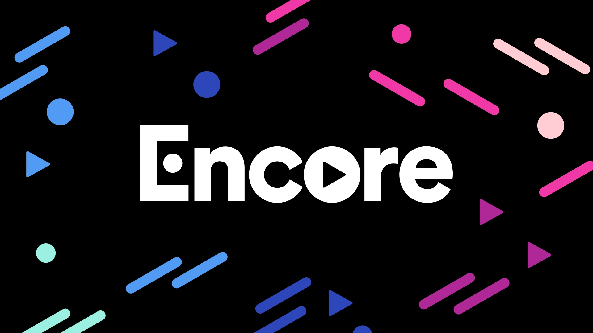

## Introducing Encore

Encore is the family of design systems that has everything teams need to build beautiful, scalable Spotify apps.

What's different about Encore is that it isn't a single monolithic thing. It's a framework that brings Spotify's existing design systems under one brand—a "system of systems."

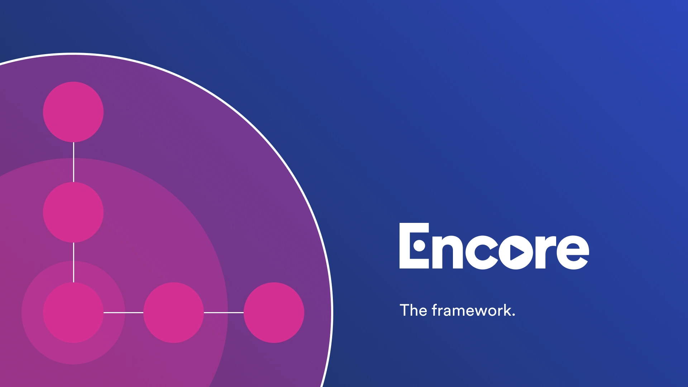

There are several design systems inside Encore, each managed by a different team around the company. And while these teams maintain the different systems, anyone who builds products at Spotify can contribute.

So is Encore Spotify's "new design system"? Not exactly. The framework is new, but Encore actually reuses a lot of the great that went into our previous design systems. We've either straight-up rebranded them or extracted parts of them to create the new Encore systems.

The different systems stay connected because they're all built using [design tokens](https://medium.com/eightshapes-llc/tokens-in-design-systems-25dd82d58421), and they live on the same website, following a similar structure defined by the Encore framework. Before, we had 22 disconnected design systems; now, we still have multiple systems, but they're all connected and under the same umbrella.

### Design systems inside Encore

Here's what Encore looks like under the hood.

#### Encore Foundation

At the center, we have Encore Foundation. It's where we keep things like color, type styles, motion, spacing, plus guidelines for writing and accessibility. It's also where our design tokens live. These are things everyone should use—it's what makes Spotify look like Spotify. Using Encore Foundation is the minimum bar for every Spotify product.

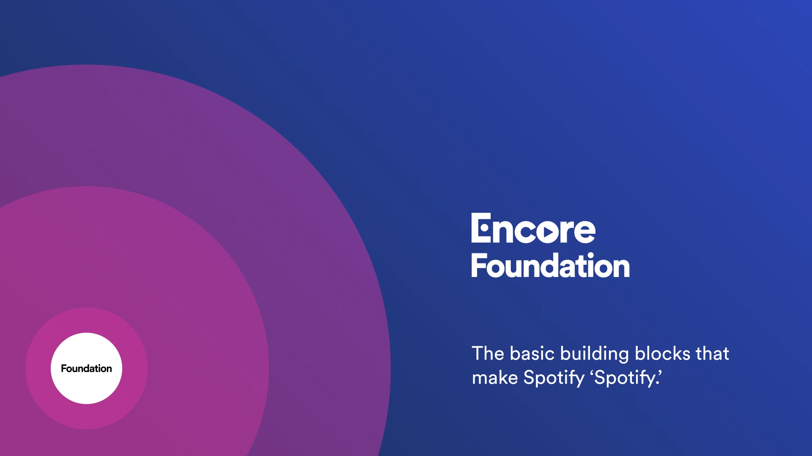

#### Encore Web

Next up, we have Encore Web. It offers all the things found in typical web design systems: buttons, dialogs, forms controls, and more. These components can be used in anything that's built using web tech—from web apps to websites, our desktop client, and, yes, even the fridge app.

Encore Web has the shared resources for our web-based platforms, but it _also_ includes everything from Foundation. The components are built using tokens, and they follow the patterns and guidelines defined in Foundation. So the systems aren't stand-alone things: they're connected.

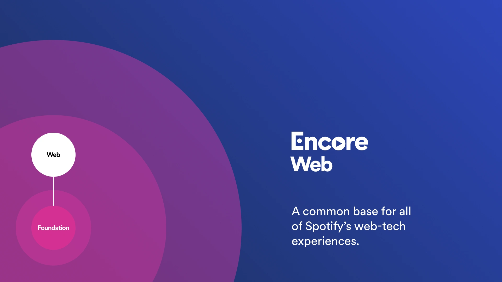

#### Encore Mobile

We're still defining this one—similar to Encore Web, we envision this being the place for common components that are shared across multiple mobile apps.

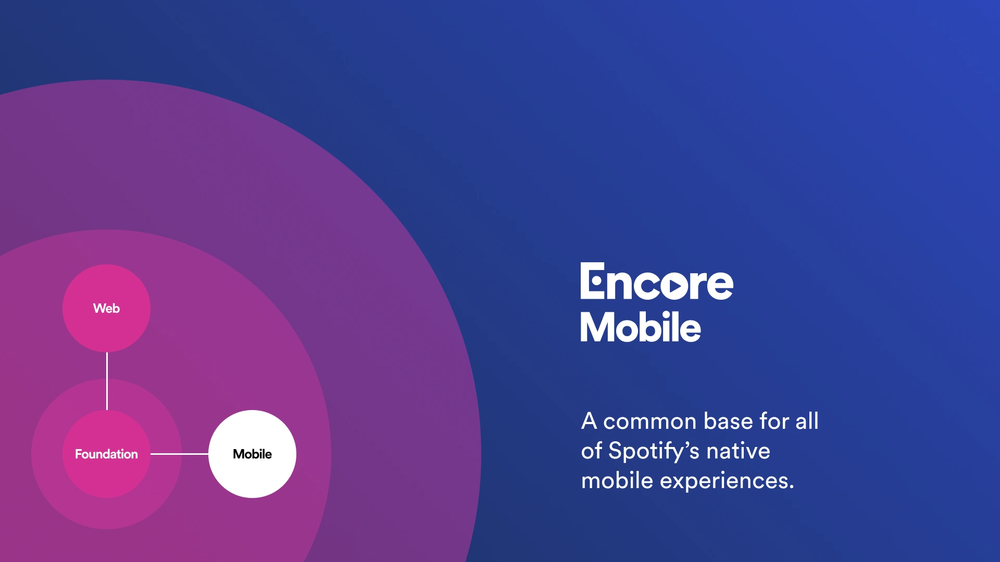

#### Local design systems

But that's not all, folks. In this next layer, Encore also contains what we call "local design systems." Local systems are a place to keep design elements that are tailored for specific products or audiences. These are things that need to be shared—just not shared across _all_ of Spotify.

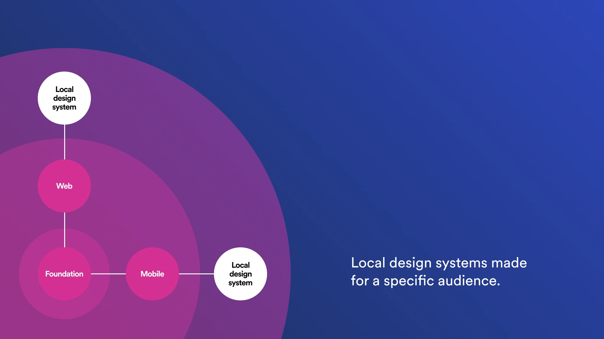

Some web components are only used in experiences for artists or podcasters (for example, the [Spotify for Artists](https://artists.spotify.com/) app may need a special navigation pattern or table layout). With the Encore framework, we can keep custom design elements in a local system so all the teams working on Spotify for Artists can share them.

It's a similar idea on the mobile side. There are lots of teams working on the main Spotify app, so there's a big need for shared mobile components and patterns. These design elements live inside a local system that's tailored to the platform (iOS and Android mobile apps) and audience (people who listen to music and podcasts).

Right now we have two local systems, but we don't think this is the final set. With Encore, we can add extra local systems if needed—for example, in the future we may add local systems for stand-alone apps like [Spotify Kids](https://newsroom.spotify.com/2019-10-30/introducing-spotify-kids-a-new-standalone-app-for-the-next-generation-of-listeners/) and [Stations](https://www.spotify.com/us/stations/). The key is that they stay connected, and that they're all available in the same place (the Encore website).

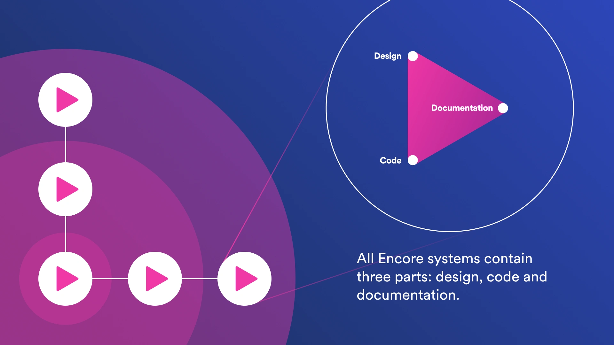

To recap, each of the small circles above is a fully fledged design system that:

- Provides design assets, code, and documentation
- Builds on the other systems
- Is actively maintained by a dedicated team
- Has a defined interface for engineers to work with

This underlying structure is important for the success of the overall Encore program, but it's not something everyone needs to know about. If you're a designer, engineer, or writer at Spotify, you'd just pick the Encore design system that's relevant to you, then dive into the shared resources.

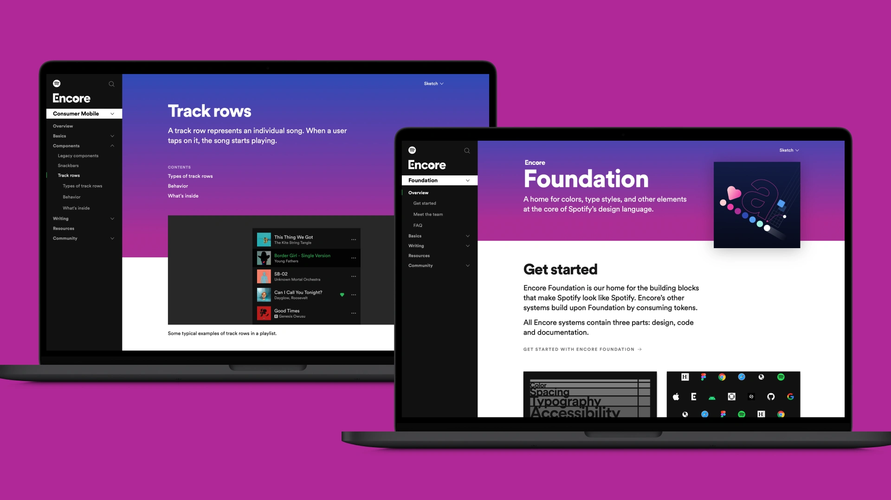

## Some final thoughts

We saw that as Spotify's visual language and product strategy evolved, our design systems had to change too. We've seen how [a design system isn't one-size-fits-all—it](https://spotify.design/articles/2018-12-04/a-design-system-isnt-one-size-fits-all/) needs to be tailored to the company's needs.

Perhaps the biggest lesson for us was how important it is to understand the company culture and adapt to it. For a design system to work, it needs to embrace the company's characteristics and peculiarities. For us, that meant acknowledging the huge product landscape we live in and the autonomous ways in which our teams work. Rather than having a single system or team, we believe it's better for Spotify to have a family of design systems, taken care of by several distributed teams.

This is just the beginning, and there's a lot to figure out as we move forward with building our system of systems. While Encore isn't publicly available right now, we'll keep sharing what we learn as we go—so stay tuned for future posts!

_Big thanks to everyone who’s worked on Spotify’s design systems over the years! Design systems are a team sport, and we’ve had a lot of players...too many to name, but you know who you are._